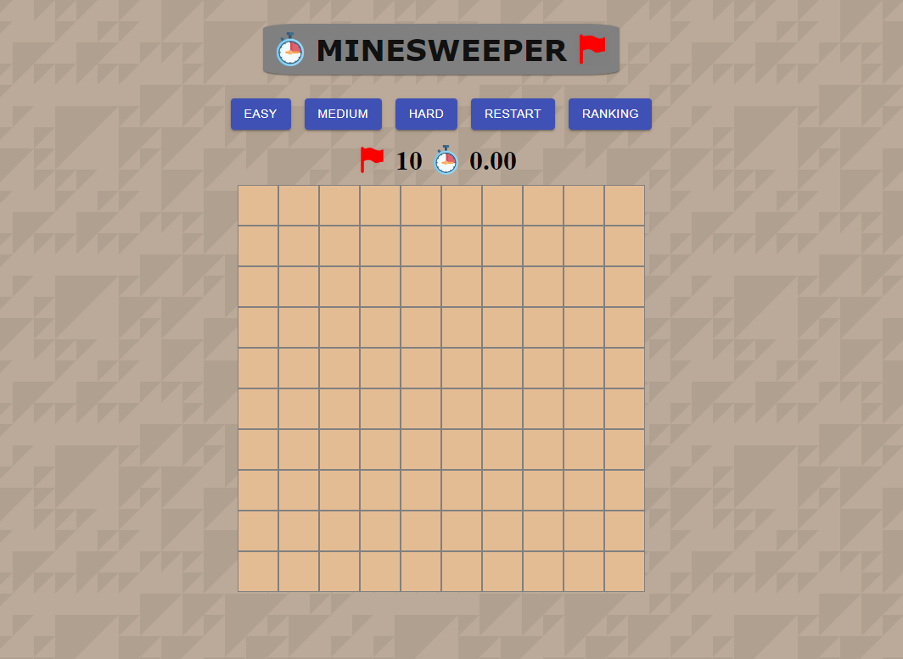

# Minesweeper

[Minesweeper](https://minesweeper-reactapp.herokuapp.com/) is a classic single-player logic-based computer game played on a board whose goal is to locate all the hidden mines in a shortest time.

## Preview

## Guide

1. Player can change difficulty by clicking on the "EASY", "MEDIUM", "HARD" buttons.
2. Player can locate a bomb by right click the box
